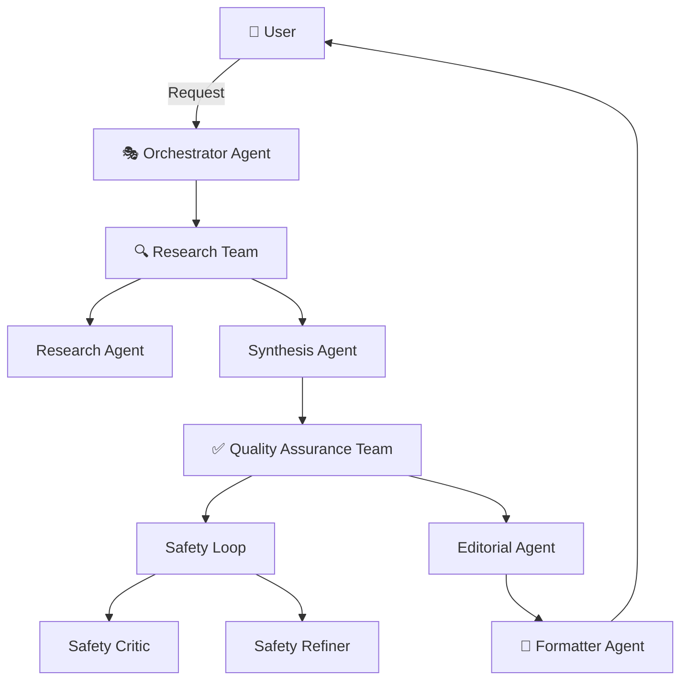

<div align="center">

# 👶 Toddle Ops

**AI-Powered Project Generation for Exhausted Caregivers**

[](https://www.python.org/downloads/)
[](https://google.github.io/adk-docs/)
[](LICENSE)

[Quick Start](#-quick-start) • [Features](#-features) • [Architecture](#-architecture) • [Demo](#-demo)


</div>

---

## 🎯 What is Toddle Ops?

Keeping a toddler happily occupied is a full-time job—and you probably already have one. Add sleep deprivation to the mix, and those enriching activities your little one needs can feel impossible to manage.

**Toddle Ops is your AI-powered concierge for toddler activities.** Using a sophisticated multi-agent system, it researches, validates, and formats safe, engaging projects tailored for children aged 1-3 years—all in seconds.

> **The mission:** Lower the barrier to quality toddler activities to *absolute zero*. All you need to do is bring the energy (we know that's already asking a lot 💪).

### 💡 Born from the Trenches

This project grew out of the [Google 5-Day AI Agents Intensive Course](https://www.kaggle.com/learn-guide/5-day-agents) and the [Agents Intensive Capstone Project](https://www.kaggle.com/competitions/agents-intensive-capstone-project). It's a real-world solution to a real-world problem: parenting is hard, and AI can help.

---

## ✨ Features

- 🤖 **Multi-Agent Architecture** - Specialized AI agents handle research, safety validation, and formatting
- 🔍 **Smart Research** - Automatically searches for age-appropriate activities using Google Search
- 🛡️ **Safety First** - Built-in safety critic and refiner ensure projects are toddler-safe
- ✏️ **Editorial Polish** - Grammar and clarity checks for easy-to-follow instructions
- 💾 **Session Memory** - Remembers your preferences across conversations
- 🌐 **Web Interface** - Clean, modern UI powered by ADK Web Server
- 📝 **Structured Output** - Consistent format with materials, duration, and step-by-step instructions

---

## 🚀 Quick Start

### Prerequisites

- **Python 3.13+** - [Download here](https://www.python.org/downloads/)
- **uv** - Fast Python package installer ([Installation guide](https://docs.astral.sh/uv/getting-started/installation/))
- **Google Gemini API Key** - [Get one here](https://aistudio.google.com/app/apikey)

### Installation

```bash
# Clone the repository
git clone https://github.com/asenetcky/toddle-ops.git
cd toddle-ops

# Install dependencies with uv
uv sync

# Set up your environment variables
cp .env.example .env
# Edit .env and add your GOOGLE_API_KEY
```

### Create `.env` File

Create a `.env` file in the project root:

```bash
# Required: Gemini API Key
GOOGLE_API_KEY=your_api_key_here

# Optional: For production deployments
GOOGLE_PROJECT_ID=your_project_id
DEPLOYED_REGION=us-central1
```

---

## 🎮 Usage

### Option 1: Web Interface (Recommended)

Launch the interactive web UI with hot-reloading:

```bash
cd src/toddle_ops/agents
adk web
```

Then open [http://127.0.0.1:8000](http://127.0.0.1:8000) in your browser.

### Option 2: Command Line

Run the agent directly from the terminal:

```bash
adk run orchestrator
```

### Example Interaction

```
You: I need a project for my 2-year-old
Agent: [Researches, validates, and formats a safe project...]

📋 Toddler Sensory Bin Adventure

🕐 Duration: 20 minutes

📦 Materials:
• Large plastic container or bin
• Dry rice or pasta (1-2 cups)
• Kitchen utensils (measuring cups, spoons)
• Small toys or objects to hide

📝 Instructions:
1. Fill the bin with rice or pasta
2. Hide small toys throughout
3. Let your toddler explore and discover
4. Supervise closely to prevent ingestion
...
```

---

## 🏗️ Architecture

Toddle Ops uses [Google's Agent Development Kit (ADK)](https://google.github.io/adk-docs/) to orchestrate multiple specialized agents:



### Agent Roles

| Agent | Responsibility |
|-------|---------------|
| **Orchestrator** | Routes requests and manages overall workflow |
| **Research Team** | Searches for age-appropriate projects using Google Search |
| **Synthesis Agent** | Combines research into a coherent project structure |
| **Safety Critic** | Evaluates projects for toddler safety (choking hazards, supervision needs) |
| **Safety Refiner** | Revises projects based on safety feedback |
| **Editorial Agent** | Polishes grammar, clarity, and age-appropriateness |
| **Formatter** | Outputs clean, consistent markdown format |

---

## 📸 Demo

### Web Interface


---

## 🛠️ Development

### Project Structure

```
toddle-ops/
├── src/toddle_ops/
│   ├── agents/           # Agent definitions
│   │   ├── orchestrator/ # Root agent
│   │   ├── research_team/
│   │   └── quality_assurance_team/
│   ├── models/           # Pydantic models
│   ├── services/         # Memory, sessions, callbacks
│   └── config.py         # Configuration
├── tests/                # Test suite
├── notebooks/            # Marimo notebooks for development
└── pyproject.toml        # Project dependencies
```

### Running Tests

```bash
uv run pytest
```

### Code Quality

```bash
# Format and lint
make ruff

# Or manually:
uvx ruff check --select I --fix
uvx ruff format
```

---

## 🚢 Deployment

### Google Cloud (Vertex AI Agent Engine)

```bash
# Install gcloud CLI
# https://cloud.google.com/sdk/docs/install

# Configure your project
export GOOGLE_PROJECT_ID=your_project_id
export DEPLOYED_REGION=us-central1

# Deploy
cd src/toddle_ops/agents
adk deploy agent_engine \
  --project=$GOOGLE_PROJECT_ID \
  --region=$DEPLOYED_REGION \
  vertex_agent \
  --agent_engine_config_file=vertex_agent/.agent_engine_config.json
```

---

## 🗺️ Roadmap

- [x] Multi-agent architecture with ADK
- [x] Safety validation system
- [x] Web interface with session memory
- [ ] User authentication and project history
- [ ] Local project storage with MCP SQLite integration
- [ ] PDF export of projects
- [ ] Image generation for project visualization
- [ ] Mobile-responsive design improvements

---

## 🤝 Contributing

Contributions are welcome! This project is a learning experiment, so feel free to:

- 🐛 Report bugs or issues
- 💡 Suggest new features
- 🔧 Submit pull requests
- 📖 Improve documentation

---

## 📄 License

This project is licensed under the MIT License - see the [LICENSE](LICENSE) file for details.

---

## 🙏 Acknowledgments

- **Google ADK Team** - For the excellent Agent Development Kit framework
- **Kaggle & Google** - For the 5-Day AI Agents Intensive Course
- **Exhausted parents everywhere** - This one's for you ☕

---

<div align="center">

**Made with ❤️ (and way too much caffeine) by [asenetcky](https://github.com/asenetcky)**

[⬆ Back to Top](#-toddle-ops)

</div>


